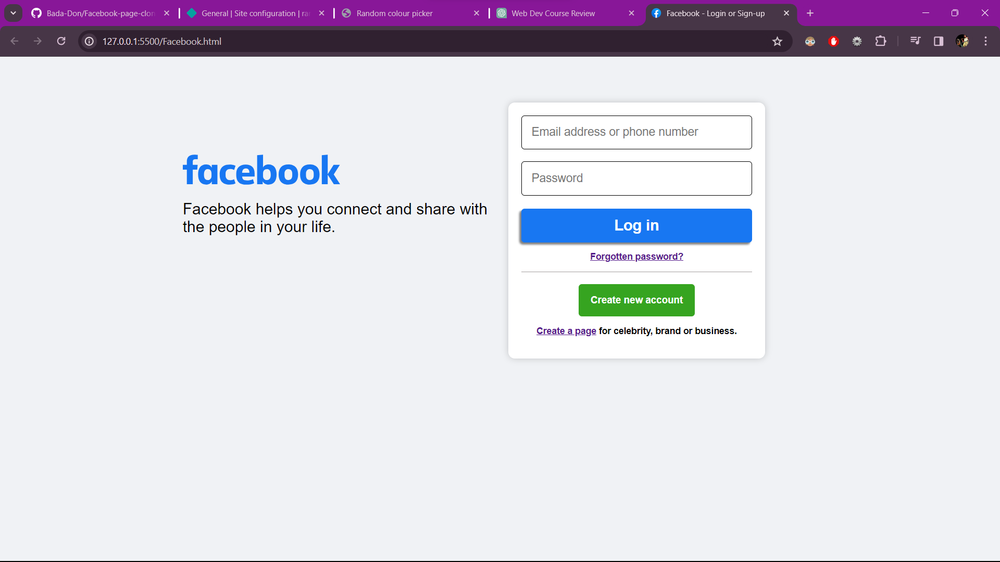

# Facebook-page-clone
# Clone of Facebook Login Page

This project is a clone of the Facebook login page, made for educational purposes and demonstration of HTML, CSS, and JavaScript skills. It does not actually authenticate users.

## Usage

1. Visit the project website: [Clone of Facebook Login Page](https://www.example.com)
2. Enter your email or phone number and password.
3. Click on the 'Log In' button.

Please note that this project does not authenticate users and should not be used for actual authentication purposes.

## Tech Stack

- HTML
- CSS
- JavaScript

## Screenshots

## Acknowledgments

- Facebook for inspiring this project
- Hat tip to anyone who's code was used
- Inspiration from various sources, such as freecodecamp, Traversy Media, etc.